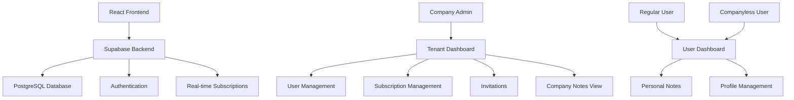

# 🏢 Tenant User Management System

<div align="center">


**A comprehensive multi-tenant user management system with subscription-based features, notes management, and company administration tools.**

[🚀 Live Demo](#) • [📖 Documentation](#features) • [🛠️ Setup Guide](#quick-start) • [🎯 Features](#features)

</div>

---

## 📋 Table of Contents

- [✨ Features](#-features)
- [🚀 Quick Start](#-quick-start)
- [🏗️ Architecture](#️-architecture)
- [💾 Database Schema](#-database-schema)
- [🎨 UI Components](#-ui-components)
- [🔐 Authentication](#-authentication)
- [📱 User Roles](#-user-roles)
- [🛠️ Development](#️-development)
- [📊 Database Functions](#-database-functions)
- [🤝 Contributing](#-contributing)

---

## ✨ Features

### 🏢 **Multi-Tenant Architecture**
- **Company Management** - Full tenant isolation with company-specific user management
- **Role-Based Access Control** - Admin, User, and Companyless user roles
- **Invitation System** - Invite users to join companies with secure invitation links

### 👥 **User Management**
- **Dual Authentication** - Separate flows for individual users and company admins
- **Profile Management** - Complete user profiles with subscription tracking
- **User Invitations** - Company admins can invite and manage team members

### ⭐ **Subscription System**
- **Tiered Subscriptions** - Standard (3 notes) and Premium (unlimited) plans
- **Admin Controls** - Company admins can upgrade/downgrade user subscriptions
- **Usage Limits** - Automatic enforcement of subscription-based limits
- **Audit Trail** - Complete history of subscription changes

### 📝 **Notes Management**
- **CRUD Operations** - Create, read, update, delete notes with rich features
- **Subscription Limits** - Standard users limited to 3 notes, Premium unlimited
- **Tags & Favorites** - Organize notes with tags and mark favorites
- **Soft Delete** - Safe deletion with recovery options

### 🎨 **Modern UI/UX**
- **Responsive Design** - Works perfectly on desktop, tablet, and mobile
- **Gradient Themes** - Beautiful modern interface with smooth animations
- **Interactive Components** - Hover effects, transitions, and visual feedback
- **Dashboard Analytics** - Real-time stats and user activity tracking

---

## 🚀 Quick Start

### Prerequisites
```bash
Node.js >= 14.0.0
npm >= 6.0.0
Supabase Account
```

### 1️⃣ Clone & Install
```bash
git clone <repository-url>
cd tenant-user-management
npm install
```

### 2️⃣ Environment Setup
Create `.env.local` file:
```env
REACT_APP_SUPABASE_URL=your_supabase_url
REACT_APP_SUPABASE_ANON_KEY=your_supabase_anon_key
```

### 3️⃣ Database Setup
Run the following SQL files in your Supabase SQL Editor:

1. **Core Schema**:
   ```sql
   -- Run database_schema_supabase.sql
   ```

2. **Notes System**:
   ```sql
   -- Run notes_schema.sql
   ```

3. **Subscription Management**:
   ```sql
   -- Run upgrade_subscription_schema.sql
   ```

4. **Invitations System**:
   ```sql
   -- Run invitations_schema.sql
   ```

### 4️⃣ Launch Application
```bash
npm start
```

🎉 **Open [http://localhost:3000](http://localhost:3000) to view the app!**

---

## 🏗️ Architecture



---

## 💾 Database Schema

### Core Tables

| Table | Purpose | Key Features |
|-------|---------|--------------|
| `profiles` | User profiles | Subscription tracking, role management |
| `tenants` | Company data | Multi-tenant isolation |
| `notes` | User notes | Subscription limits, soft delete |
| `invitations` | User invites | Secure invitation system |
| `activity_logs` | Audit trail | Complete activity tracking |

### Key Relationships
- **One-to-Many**: Tenant → Users
- **One-to-Many**: User → Notes
- **Many-to-One**: Invitations → Tenant

---

## 🎨 UI Components

### 🏢 **Company Dashboard**
- **Modern Card Layout** - Clean, professional design
- **Real-time Stats** - User counts, active sessions
- **Quick Actions** - One-click access to key features
- **Tabbed Interface** - Users, Invitations, Subscriptions, Notes

### 👤 **User Dashboard**
- **Personalized Welcome** - Dynamic greeting with subscription status
- **Profile Information** - Complete user details display
- **Notes Management** - Full CRUD interface with limits display

### 🔐 **Authentication**
- **Role Selection** - Choose between User/Company signup
- **Form Validation** - Real-time validation with error messages
- **Responsive Design** - Works on all device sizes

---

## 🔐 Authentication

### Supported Flows
- ✅ **Email/Password** - Standard authentication
- ✅ **Role-based Routing** - Automatic dashboard selection
- ✅ **Session Persistence** - Maintains login state
- ✅ **Protected Routes** - Secure access control

### User Types
| Role | Access Level | Features |
|------|-------------|----------|
| **Company Admin** | Full tenant control | User management, subscriptions, invitations |
| **Company User** | Limited access | Personal notes, profile |
| **Individual User** | Personal only | Notes, profile management |

---

## 📱 User Roles

### 🏢 **Company Admin**
```javascript
// Full company management capabilities
- Invite users to company
- Manage user subscriptions (upgrade/downgrade)
- View all company user notes
- Access company analytics
- Manage team members
```

### 👤 **Company User**
```javascript
// Limited company member access
- Personal notes management
- Profile updates
- Subscription benefits based on admin settings
```

### 🆓 **Individual User**
```javascript
// Standalone user account
- Personal notes (subscription limited)
- Profile management
- Can be invited to join companies
```

---

## 🛠️ Development

### Project Structure
```
src/
├── components/
│   ├── Auth/                 # Authentication components
│   ├── Dashboard/            # Dashboard layouts
│   ├── Notes/               # Notes management
│   └── Users/               # User management
├── contexts/
│   └── AuthContext.js       # Global auth state
├── lib/
│   └── supabase.js         # Database client
└── App.js                  # Main routing
```

### Available Scripts
```bash
npm start      # Development server
npm build      # Production build
npm test       # Run tests
npm eject      # Eject from CRA
```

### Key Dependencies
- **@supabase/supabase-js** - Database & auth client
- **react-router-dom** - Client-side routing
- **react** - Frontend framework

---

## 📊 Database Functions

### Subscription Management
```sql
-- Upgrade user subscription
SELECT upgrade_user_subscription(user_id, 'premium');

-- Downgrade with validation
SELECT downgrade_user_subscription(user_id, 'standard');

-- Get subscription history
SELECT * FROM get_subscription_history(user_id);
```

### Notes Management
```sql
-- Get user notes with limits
SELECT * FROM get_user_notes_with_limits(user_id);

-- Check note creation permission
SELECT can_create_note(user_id);
```

### User Management
```sql
-- Get company users
SELECT * FROM get_company_users(tenant_id);

-- Send invitation
INSERT INTO invitations (email, tenant_id, invited_by);
```

---

## 🤝 Contributing

### Getting Started
1. **Fork** the repository
2. **Create** a feature branch: `git checkout -b feature/amazing-feature`
3. **Commit** changes: `git commit -m 'Add amazing feature'`
4. **Push** to branch: `git push origin feature/amazing-feature`
5. **Open** a Pull Request

### Development Guidelines
- ✅ Follow React best practices
- ✅ Write meaningful commit messages
- ✅ Test your changes thoroughly
- ✅ Update documentation as needed

### Code Style
```javascript
// Use functional components with hooks
const MyComponent = () => {
  const [state, setState] = useState(initialValue);
  
  return (
    <div className="component">
      {/* Component JSX */}
    </div>
  );
};
```

---

<div align="center">

### 🌟 **Star this repo if you find it helpful!** 🌟

**Built with ❤️ using React & Supabase**

[⬆️ Back to Top](#-tenant-user-management-system)

</div>
